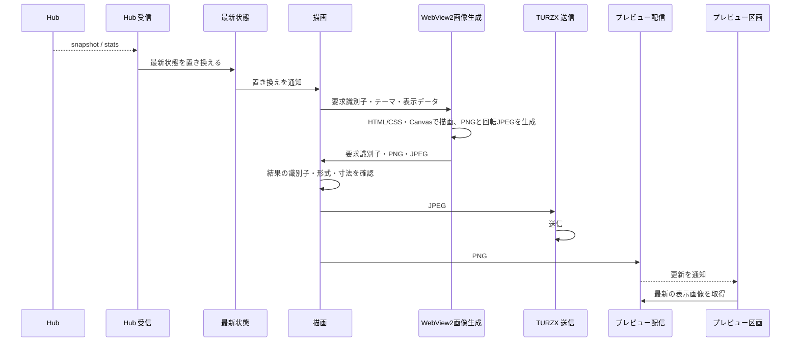

# UCP-1. 受信した最新状態を表示画像にして出力する

適用条件と関与コンテナは [アーキテクチャの一覧](../architecture.md#patterns) を参照します。図は主成功系列を役割名で示し、UC ごとの逸脱は末尾に記録します。

| 役割 | 責務 | 実装パス（段階4完了時に記入） |
| --- | --- | --- |
| Hub 受信 | 保存済みの接続設定で SSE に接続し、snapshot・stats を最新状態へ渡す。止まったら1秒から倍にしながら（上限60秒）再接続する。接続設定の保存時にも接続し直す | `internal/hub/receiver.go` |
| ローカル取得 | 取得元が `Local` のとき、同梱の tokscale を専用の設定ディレクトリで実行する。起動時に探索先ファイルの探索先（なければ `clients --json` の探索先。Cursor を除く）の監視を始め、`cursor sync --json` の後に `graph --no-spinner` で3期間を集計し、並行して `usage --json` で利用枠を取得する。`clients --json` を実行したときは、その後に最初に成功した graph の `summary.clients` と合わせて探索先ファイルに保存し、graph に既知でないツールが現れたときに取り直す。変更は最初の通知から2秒待ってまとめ、graph は開始間隔10秒以上・同時に1つまでとし、Cursor の同期とは同時に実行しない。利用枠は、提供元が取得を制限するため、利用記録の変更や Cursor の同期とは切り離し、前回の取得から2分ごとに取得する（これより頻繁には取得しない）。取得結果から抜けた提供元は、前回の値を保つ。Cursor の同期は起動時の結果に応じて45秒ごと・停止・待ち時間を倍にする再試行（上限10分）とする。日付が変わると集計し直す。集計と利用枠がそろってから最新状態へ渡し、内容が同じなら渡さない。失敗した値は前回のまま保つ。取得元の変更と終了時に監視と子プロセスを止める | `internal/localusage/reader.go`、`internal/localusage/tokscale.go`、`internal/localusage/scan.go`、`internal/localusage/platform_windows.go` |
| 最新状態 | 受信した利用状況をメモリにだけ保持し、置き換えを描画へ通知する | `internal/usage/usage.go` |
| 描画要求 | 最新状態の置き換え・保存済みの表示スタイルの変更・1分ごとの時刻で、利用状況の表示データを作り、1件ずつWebView2へ描画を求める。残量順・配置上限・グループ化・色（ペースと残量の悪い方）は本体で決める。描画要求は初回ロードと再ロードでも取得できる。1件の応答期限は10秒とし、期限切れの要求を終了する。要求識別子が一致する結果だけを受け取り、形式と寸法を確認して確定する | `internal/display/theme_data.go`、`internal/display/canvas.go`、`internal/display/service.go` |
| テーマのビルド | テーマの形式・寸法・参照ファイル・識別子の重複をビルド時に検査し、不正な場合はビルドを失敗させる。HTMLの`img src`とCSSの`url()`にあるテーマ内画像を参照元ファイルから解決して内包し、Handlebarsをコンパイルする。共通Agentアイコンは`/assets/agents/`から参照する。プレビューにも同じ素材解決を使う | `frontend/build/theme-build.ts`、`frontend/vite.config.ts`、`themes/preview/server.mjs` |
| 画像生成 | 常駐WebView2で、コンパイル済みHandlebarsとテーマのHTML/CSSから1920×462の画像をCanvasに描く。同じ描画から`Canvas.toDataURL`でPNGと時計回り90度回転・品質0.85のJPEGを生成する。GaugesとBarsの配置はテーマファイルで定義し、共通Agentアイコンを参照する。初回の素材取得に失敗した場合は次の要求で取り直す。画像生成処理はReactと画面の表示・非表示から独立して起動し、JavaScriptのタイマーやrequestAnimationFrameには依存しない | `frontend/src/features/display/theme-renderer.ts`、`themes/gauges/`、`themes/bars/`、`internal/display/icons/` |
| TURZX 送信 | 画像生成処理が返したJPEGを再圧縮せず、表示先のTURZXへ逐次送る。送信中に届いた画像は最新の1枚だけ残す。再接続時に最新の画像を送る。アプリの終了時に再起動コマンドを送る | `internal/display/output.go`、`internal/turzx/protocol.go`、`internal/turzx/conn_windows.go` |
| 利用枠の選択 | `Display` 画面の `Usage Limits` で、契約と枠の表示・非表示を選ぶ。表示しない枠の識別子を設定ファイルの `hiddenLimits` に保存し、保存のたびに描画へ再生成を求める。描画は、最新状態から表示しない枠を取り除いたものに、契約の選び方・並び順の規則を適用する。保存に失敗したときは、選択も表示画像も変えずにエラーを返す。保存済みの選択を読めないときは、すべての枠を描く | `internal/display/limits.go`、`internal/display/service.go`、`internal/settings/service.go`、`frontend/src/usecases/show-usage/UsageLimitSelect.tsx`、`frontend/src/features/display/queries.ts` |
| プレビュー配信 | 本体の Wails サービス。最新の表示画像を画面へ返し、画像の更新をイベントで通知する | `internal/display/service.go` |
| プレビュー区画 | ウィンドウで最新の表示画像を表示する。画像を描かず、状態も持たない | `frontend/src/usecases/show-usage/UsagePreview.tsx`、`frontend/src/features/display/queries.ts` |
| スタイル一覧 | ビルドに含まれるテーマ定義と、アプリ内部に取り込んだ表示スタイルを列挙する。組み込みの Gauges と Bars は常に先に出し、各スタイルで描いたプレビューを見せる。TURZX へ送る画像と、現在の表示に使っているスタイルは変えない | `frontend/src/features/styles/catalog.ts`、`frontend/src/usecases/browse-styles/StyleList.tsx`、`frontend/src/routes/styles.tsx`、`frontend/src/app/Shell.tsx`、`frontend/src/features/display/theme-renderer.ts`、`internal/styles/service.go` |
| スタイルの取り込み | 指定フォルダーを検査し、合格したファイルだけをアプリ内部の定義置き場へコピーして定義に加える。取消、不合格、識別子の重複、コピー失敗では定義も内部のファイルも変えない | `internal/styles/service.go`、`internal/desktop/service.go`、`frontend/src/usecases/add-style/AddStyle.tsx`、`frontend/src/features/styles/catalog.ts`、`frontend/src/features/styles/prepare.ts` |

- 整合性: 状態更新の主体は最新状態 / 結果確定点はメモリ上の最新状態の置き換えと、要求識別子が一致する画像結果の受領 / 障害時は、受信の失敗では最後の最新状態と表示を保ったまま再接続を続け、描画の失敗・応答期限切れでは前回の表示を保ち、次の状態変更または定期更新で再生成する。TURZXの送信失敗では画像を捨てて再接続後に最新の画像を送る。いずれも他の処理とアプリを止めない / 境界は、描画を逐次にし、送信は最新の1枚だけで追いつくようにすること。
- モックに置き換える境界と合成点: 本番の実行経路は Hub 受信とローカル取得の実処理だけを使い、最新状態へ仕様合意用の固定データを入れる分岐は置かない。Hub 経路の検証時は、接続設定の URL を制御可能な SSE サーバーへ向け、受信・描画・プレビュー配信は本番の処理を使う。「Style一覧を閲覧する」の段階2・3では、定義一覧を固定ファイルへ差し替えた。段階4で削除し、現在はビルドに含まれるテーマ定義を一覧にする。「Styleを追加する」は、指定したフォルダーを検査してアプリ内部の定義置き場へコピーし、その定義で一覧を作り直す。一覧の並び、現在の表示スタイル、TURZX への送信は本番の処理を使う。起動・終了と検証の手順は [プロジェクト定義](../project.md#execution) を参照する。

UC 固有の逸脱: 「Style一覧を閲覧する」は、その時点の表示スタイル定義を列挙し、各スタイルで描いたプレビューを一覧に出す。TURZX へ送る画像と、現在の表示に使っているスタイルは変えない。「Styleを追加する」は、指定したフォルダーを検査し、合格したファイルをアプリ内部へコピーして定義を1つ加える。
